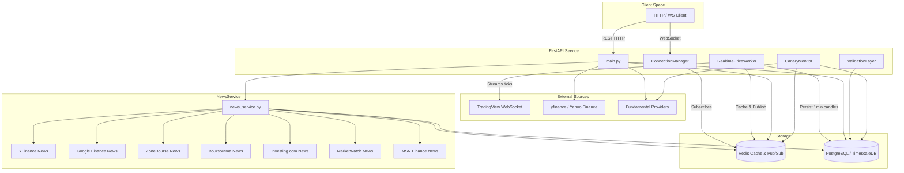
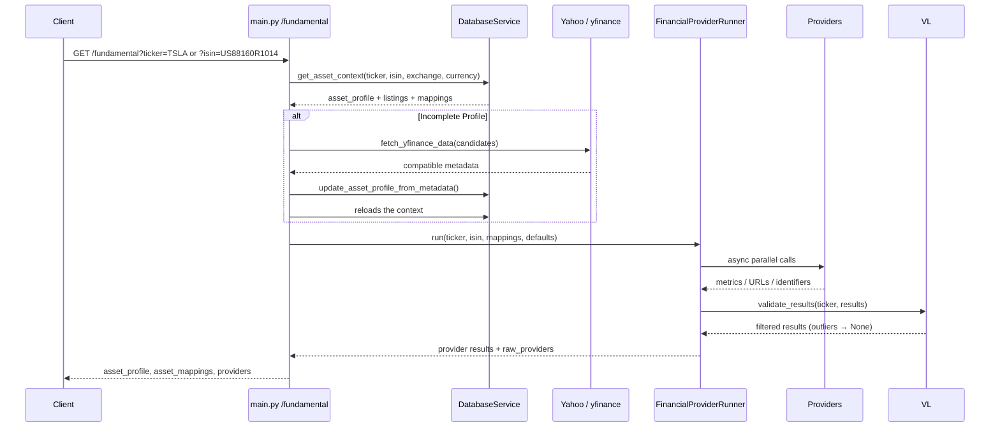
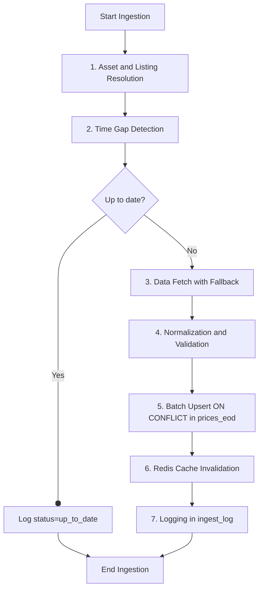
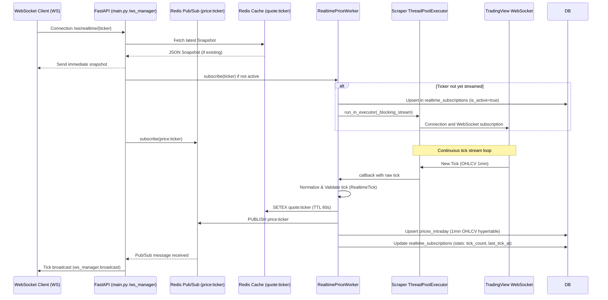
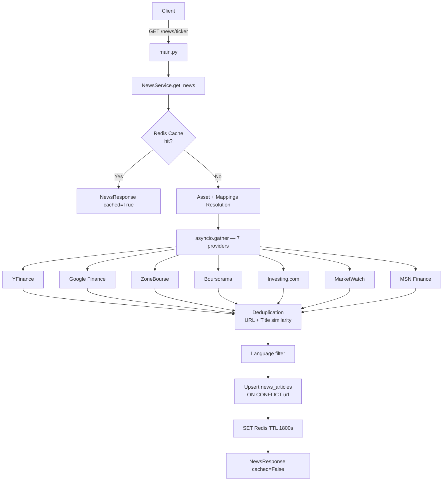
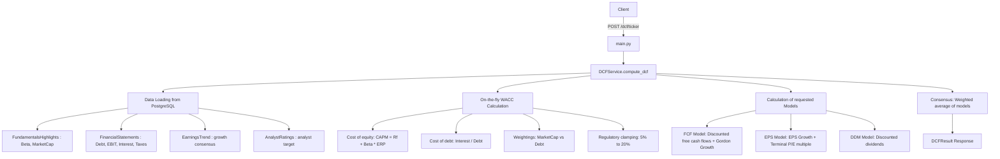
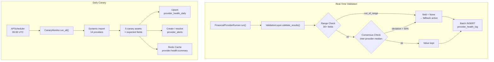

# Technical Architecture FonRex

Last update: 2026-07-13 (legacy cleanup: `eod/`, `record/`, `fundamental/providers/`, `data_service.py`, `init_db.py`, `seed_assets.py`; ISIN-deduplicated import revamp; migration 009; `clean_isin_duplicates` script; NewsService addition with 7 news providers, `news_articles` table, migration 010; structuring formatting modules and exchange mappings; addition of financial valuation module and DCF/WACC calculations, Phase 11; addition of provider monitoring system with ValidationLayer, CanaryMonitor, alerts and 7 health endpoints, `provider_health_log`/`provider_health_daily`/`provider_alerts` tables, migration 011, Phase 12).

This document describes the architecture actually observed in the source code. FonRex Pro is a FastAPI API that aggregates market data, fundamentals, asset metadata, and financial news. The system combines PostgreSQL/TimescaleDB, Redis, yfinance, asynchronous web providers, an ISIN-based CSV import, a multi-source news aggregation engine, and an automated provider health monitoring system.

## Overview



The Docker runtime consists of four services:

- `fonrex-api`: Python 3.12 API, FastAPI, Gunicorn, and Uvicorn worker, exposed on port `5000`.
- `fonrex-db`: `timescale/timescaledb-ha:pg16` image, target database `fonrex`.
- `fonrex-redis`: Redis 7, application cache with `allkeys-lru` policy, 256 MB memory limit.
- `fonrex-migrate`: Alembic migration container (`migrate` Docker profile), executes `alembic upgrade head` in isolation outside the API lifecycle.

The API container mounts the repository in `/app`, which also makes the `data/*.csv` files and static logos under `/app/static` available.

## Startup

The Docker startup goes through `entrypoint.sh`:

1. Waits for PostgreSQL on `db:5432`.
2. Waits for Redis on `redis:6379`.
3. Applies database migrations via Alembic (`alembic upgrade head`).
4. Launches `gunicorn --worker-class uvicorn.workers.UvicornWorker main:app`.

At application startup, `main.py` initializes:

- `DatabaseService` for synchronous ORM accesses.
- `QueryService` for asynchronous historical queries.
- `CacheService` for the synchronous Redis abstraction.
- `HistoricalIngestionService` for EOD ingestion endpoints.
- `TechnicalIndicatorService` for on-the-fly indicator calculations.
- `RealtimePriceWorker` which restores all active subscriptions from `realtime_subscriptions`.
- An asynchronous Redis client for specific endpoints.
- `FinancialsAggregator` for `/fundamental` routes.
- `NewsService` for `/news` routes, initialized with the shared async SQLAlchemy session factory and async Redis client.
- `ValidationLayer` for real-time validation of values returned by providers, initialized with a dedicated `async_sessionmaker`.
- `CanaryMonitor` for daily provider health checks, initialized with the same `async_sessionmaker` and Redis client.
- `AsyncIOScheduler` (APScheduler) to schedule the daily canary check execution (default 06:00 UTC, configurable via `CANARY_RUN_HOUR`).
- All these objects are published in `app.state` and resolved by FastAPI dependencies; no mutable service is kept in a global module variable.

`main.py` never creates or modifies the schema. On startup, it checks the connection and then compares the stored revision in `alembic_version` with the expected head. An unmigrated database is declared unavailable; the Docker entrypoint applies `alembic upgrade head` beforehand.

## Module Map

| Module | Responsibility |
| --- | --- |
| `main.py` | FastAPI composition root: service lifecycle, provider registry, usage log middleware, and router mounting. |
| `routers/news.py` | HTTP news routes, with `NewsService` injection via `app.state`. |
| `routers/valuation.py` | DCF, comparison, and sensitivity HTTP routes, with Redis cache and `DCFService` injection. |
| `routers/technical.py` | HTTP adapter for indicators, charts, batch, and screener; translates technical business errors into HTTP statuses and defers synchronous SQL accesses outside the event loop. |
| `routers/historical.py` | Individual/bulk ingestion and historical consultation routes, with asynchronous Redis cache. |
| `routers/assets.py` | Asset identity, listings, and EOD routes; orchestrates reading, auto-ingestion, and JSON/CSV formats. |
| `routers/fundamentals.py` | HTTP adapter and fundamentals composition root; assembles provider implementations, formatters, and enrichers behind application ports. |
| `routers/specialized.py` | HTTP adapters for SEC EDGAR, JustETF, and index constituents use cases. |
| `routers/realtime.py` | REST adapters for realtime use cases and WebSocket protocol management. |
| `routers/dependencies.py` | Common FastAPI dependencies resolving services from `app.state`. |
| `routers/errors.py` | Translates transport-independent application errors into HTTP responses. |
| `use_cases/fundamentals.py` | Fundamentals collection and read use cases; orchestrates only application ports, without FastAPI, SQLAlchemy, ORM model, yfinance, or concrete provider imports. |
| `use_cases/ports.py` | Structural contracts owned by the application layer for persistence, cache, providers, formatting, and fundamental enrichments. |
| `use_cases/specialized.py` | SEC EDGAR, JustETF, and indices use cases, with validation, cache, and application errors. |
| `use_cases/realtime.py` | Realtime quote, multi-quotes, subscription, unsubscription, and status use cases. |
| `use_cases/errors.py` | Application error vocabulary without FastAPI dependency (`InvalidInput`, `ResourceNotFound`, `DependencyUnavailable`, `UpstreamFailure`). |
| `concurrency.py` | Single boundary between asynchronous orchestration and blocking adapters, via `run_sync()` and the standard worker pool. |
| `models.py` | Central ORM models: instruments, listings, provider mappings, EOD and intraday prices, realtime subscriptions, fundamentals (highlights, statements, earnings, ratings, ESG, trends), ETFs, logs. |
| `database/service.py` | Compatibility facade and SQLAlchemy composition root; owns the engine/session factory and delegates to specialized components. |
| `database/assets.py` | Asset identity/listing, mappings, and profile enrichment repository. |
| `database/fundamentals.py` | Standard and deep fundamentals read repository. |
| `database/maintenance.py` | Statistics, SQL cache inventory, and retention/cleanup policies. |
| `database/usage.py` | API usage events persistence. |
| `database/migrations.py` | Read-only verification of the current revision against the Alembic head. |
| `database/component.py` | Shared foundation giving components short and explicit access to synchronous sessions. |
| `database/query.py` | Async queries for history from `prices_eod` or the `prices_weekly` view, asset_id resolution, ticker retrieval for bulk ingestion. |
| `database/schemas.py` | Internal Pydantic schemas for database entities (e.g., `PriceEOD`). |
| `historical/ingestion_service.py` | Missing ranges, fallbacks, persistence, and cache invalidation orchestration. |
| `realtime/worker.py` | `RealtimePriceWorker`: lifecycle, TradingView streaming, Redis pub/sub, and intraday persistence. |
| `realtime/connection_manager.py` | WebSocket client groups and realtime message broadcasting, independent of the market worker. |
| `schemas/historical.py` | Pydantic v2 schemas for historical ingestion (resolutions, sources, request/response structures). |
| `schemas/realtime.py` | Pydantic v2 schemas for realtime ticks, quote snapshots, and WebSocket messages. |
| `schemas/fundamentals.py` | Pydantic v2 schemas for financial highlights, financial statements, and earnings history. |
| `schemas/technical.py` | Pydantic v2 schemas for time series and technical indicator results. |
| `import_assets.py` | ISIN-deduplicated CSV import pipeline: `parse_csv` → `AssetImporter` (grouping by ISIN, `_upsert_asset` / `_upsert_listing` / `_create_default_mappings`); Yahoo/yfinance enrichment and logos in kept legacy functions. |
| `scripts/clean_isin_duplicates.py` | Standalone diagnostic and ISIN duplicate cleanup tool: `diagnose_duplicates`, `clean_duplicates` (re-parenting → deletion), `create_unique_index`; CLI with `--dry-run`, `--create-index`, `--isin`, `--diagnose-only`. |
| `scripts/ingest_all.py` | Administration CLI to trigger global historical ingestion of all database assets. |
| `financials/provider_runner.py` | Parallel orchestration of fundamental providers with mappings, timeouts, `raw_providers`, and optional injection of `ValidationLayer` for real-time outlier filtering. |
| `financials/enrichment/adapters.py` | Concrete yfinance adapters and ticker normalization injected into use cases by the HTTP router. |
| `financials/providers/` | Asynchronous connectors to ZoneBourse, Google Finance, Boursorama, Barrons, WSJ, MarketWatch, MorningStar, Investing, Gurufocus, Fortuneo, BourseDirect, MSN, Investir Les Echos, YahooFinance, JustETF, SECEdgar, OpenFIGI, and IndexConstituents. |
| `financials/service.py` | Separate aggregator for `/stocks/{ticker}/financials`. |
| `financials/formatter.py` | Formatting and construction of the standardized financial response (`StandardFinancials`) and EODHD formatting. |
| `financials/exchange.py` | Structured management and mapping of financial exchange codes for GuruFocus, Yahoo Finance, and Google Finance. |
| `cache/service.py` | Synchronous Redis abstraction, TTL per category, JSON serialization. |
| `valuation/dcf_service.py` | Financial valuation service implementing DCF models (FCF, EPS, DDM), on-the-fly WACC calculation (CAPM cost of equity and cost of debt), and sensitivity matrix generation. |
| `schemas/dcf.py` | Pydantic v2 schemas for custom DCF and WACC calculation requests, as well as detailed responses and sensitivity matrices. |
| `technical/indicator_service.py` | Business orchestrator independent of FastAPI for simple and multiple calculations; delegates calculation, persistence, and cache to targeted components. |
| `technical/catalog.py` | Declarative and typed registry of 18 indicators, default parameters, and TTL policies. |
| `technical/contracts.py` | Independent ports for market data, cache, WebSockets, and technical parameters. |
| `technical/calculation_engine.py` | pandas/pandas-ta engine without I/O: calculation, period validation, and conversion to business series. |
| `database/technical.py` | OHLCV read and asset identity resolution SQLAlchemy adapter. |
| `cache/technical.py` | Redis adapter for technical result serialization and caching. |
| `technical/errors.py` | Transport-independent business errors for invalid indicators, incompatible resolutions, and missing or insufficient data. |
| `news/news_service.py` | Main news orchestrator: parallel fetch of 7 providers, URL + title similarity deduplication (`difflib`), upsert `ON CONFLICT` in `news_articles`, Redis 30 min cache, language filter, global feed from DB. |
| `news/providers/yfinance_news.py` | News via yfinance `ticker.news` (native JSON, epoch → UTC datetime, `run_in_executor`). |
| `news/providers/google_finance_news.py` | Google Finance news: JSON embedded in HTML + BeautifulSoup fallback, exchange resolution (`.PA` → `EPA`, `.DE` → `ETR`, etc.), relative dates. |
| `news/providers/zonebourse_news.py` | ZoneBourse news (FR): HTML BeautifulSoup, French dates, `fr` language. |
| `news/providers/boursorama_news.py` | Boursorama news (FR): HTML BeautifulSoup, `<time datetime>` ISO, `fr` language. |
| `news/providers/investing_news.py` | Investing.com news: anti-Cloudflare headers, 403 detection, `-news` slug. |
| `news/providers/marketwatch_news.py` | MarketWatch news: `countrycode` query param for EU tickers, `<time dateTime>`. |
| `news/providers/msn_finance_news.py` | MSN Finance news: internal JSON endpoint + HTML fallback. |
| `schemas/news.py` | Pydantic v2 schemas for the news system: `RawNewsItem`, `NewsArticleSchema`, `NewsResponse`, `NewsFeedResponse`, `NewsLanguage` / `NewsSentiment` enums. |
| `monitoring/__init__.py` | Monitoring package exposing `ValidationLayer` and `CanaryMonitor`. |
| `monitoring/models.py` | Pydantic-independent business models for canary results and statuses. |
| `monitoring/ports.py` | Persistence contracts required by validation and canary controls. |
| `monitoring/canary_catalog.py` | Canary assets catalog, market compatibilities, and provider deferred import registry. |
| `monitoring/price_ranges.py` | Statistical calculation, concurrent locking, and TTL caching of dynamic price ranges. |
| `monitoring/validation_layer.py` | Real-time validation of provider values: range checks, inter-provider consensus, and logging via an injected port. |
| `monitoring/canary_monitor.py` | Daily orchestration of canary controls, aggregates, and alerts via ports. |
| `database/monitoring.py` | SQLAlchemy monitoring adapter: price history, logs, aggregates, and alerts. |
| `routers/monitoring.py` | 7 REST monitoring endpoints (`/health/*`) whose dependencies are resolved from `app.state`. |
| `historical/providers.py` | yfinance and TradingView connectors for retrieving historical bars. |
| `historical/normalization.py` | Pure OHLCV validation, deduplication, and normalization rules. |
| `schemas/monitoring.py` | Pydantic v2 schemas for monitoring: `ProviderStatus`, `ProviderHealthSummary`, `CanaryCheckResult`, `ValidationResult`, `AlertSchema`, `DailyStatSchema`, `HealthStatus`, `AlertSeverity`, `AlertType` enums. |

## Data Model

The main model is now separated into three levels:

- `assets` represents the canonical financial instrument. An ISIN should ideally identify a single instrument.
- `asset_listings` represents a listing of an instrument: ticker, exchange, currency, source, primary/active status.
- `asset_mappings` represents the provider-specific identifiers for an instrument or a listing.

This separation is necessary because:

- The same ISIN can be listed under multiple tickers, exchanges, or currencies.
- The same ticker can designate different instruments depending on the market, for example a stock and an ETF.
- Not all providers accept the same identifier: some want a Yahoo ticker, others an ISIN, others a URL or an internal code.

```mermaid
erDiagram
    ASSETS ||--o{ ASSET_LISTINGS : "has listings"
    ASSETS ||--o{ ASSET_MAPPINGS : "has global mappings"
    ASSET_LISTINGS ||--o{ ASSET_MAPPINGS : "has provider mappings"
    ASSETS ||--o{ PRICES_EOD : "has prices"
    ASSET_LISTINGS ||--o{ PRICES_EOD : "qualifies prices"
    ASSETS ||--o{ FUNDAMENTALS : "has fundamentals (legacy)"
    ASSETS ||--o| FUNDAMENTALS_HIGHLIGHTS : "has highlights"
    ASSETS ||--o{ FINANCIAL_STATEMENTS : "has financial statements"
    ASSETS ||--o{ EARNINGS_HISTORY : "has EPS history"
    ASSETS ||--o| ANALYST_RATINGS : "has ratings"
    ASSETS ||--o| ETF_DETAILS : "has ETF details"
    ASSETS ||--o{ ETF_HOLDINGS : "has ETF holdings"
    ASSETS ||--o| ESG_SCORES : "has ESG scores"
    ASSETS ||--o{ EARNINGS_TREND : "has estimates"
    ASSETS ||--o{ OUTSTANDING_SHARES_HISTORY : "has capital history"
    ASSETS ||--o{ INGEST_LOG : "has ingestion logs"
    ASSETS ||--o{ PRICES_INTRADAY : "has intraday prices"
    ASSETS ||--o| REALTIME_SUBSCRIPTIONS : "has a realtime subscription"
    ASSETS ||--o{ NEWS_ARTICLES : "has news"

    PROVIDER_HEALTH_LOG {
        int id PK
        timestamp checked_at PK
        string provider_name
        string ticker
        string field
        numeric value_received
        numeric value_expected_min
        numeric value_expected_max
        numeric consensus_value
        numeric deviation_pct
        string status
        string check_type
    }

    PROVIDER_HEALTH_DAILY {
        int id PK
        string provider_name
        date date
        int checks_total
        int checks_ok
        int checks_outlier
        int checks_null
        int checks_timeout
        numeric success_rate
        int avg_latency_ms
        bool canary_passed
        bool is_healthy
    }

    PROVIDER_ALERTS {
        int id PK
        string provider_name
        string alert_type
        string severity
        text description
        string ticker
        string field
        numeric value_received
        string value_expected
        timestamp created_at
        timestamp resolved_at
        bool is_resolved
        text resolution_note
    }

    ASSETS {
        int id PK
        string ticker
        string isin
        string name
        string display_name
        string official_symbol
        string exchange
        string currency
        string quote_type
        string sector
        string industry
        string logo_path
    }

    ASSET_LISTINGS {
        int id PK
        int asset_id FK
        string ticker
        string exchange
        string currency
        string source
        bool is_primary
        bool is_active
    }

    ASSET_MAPPINGS {
        int id PK
        int asset_id FK
        int asset_listing_id FK
        string provider_name
        string provider_ticker
        string provider_url
        float confidence_score
        bool is_active
    }

    PRICES_EOD {
        timestamp time PK
        int asset_id FK
        int asset_listing_id FK
        float open
        float high
        float low
        float close
        float adj_close
        bigint volume
        string resolution
        bool adjusted
        string source
    }

    PRICES_INTRADAY {
        timestamp timestamp PK
        int asset_id FK
        float open
        float high
        float low
        float close
        bigint volume
        string resolution
        string source
    }

    REALTIME_SUBSCRIPTIONS {
        int id PK
        int asset_id FK "unique"
        string ticker
        string tv_exchange
        string tv_symbol
        bool is_active
        timestamp subscribed_at
        timestamp last_tick_at
        bigint tick_count
    }

    FUNDAMENTALS {
        timestamp timestamp PK
        int asset_id FK
        numeric market_cap
        numeric pe_ratio
        numeric dividend_yield
        json extra_metrics
    }

    FUNDAMENTALS_HIGHLIGHTS {
        int id PK
        int asset_id FK
        timestamp date
        numeric market_cap
        numeric enterprise_value
        numeric pe_ratio
        numeric roe
        numeric roa
        numeric dividend_yield
        numeric beta
        bigint shares_outstanding
    }

    FINANCIAL_STATEMENTS {
        int id PK
        int asset_id FK
        string statement_type
        string period_type
        date period_end
        numeric revenue
        numeric ebitda
        numeric net_income
        numeric total_assets
        numeric total_equity
        numeric cash_flow
    }

    EARNINGS_HISTORY {
        int id PK
        int asset_id FK
        date period
        numeric eps_actual
        numeric eps_estimate
        numeric surprise_pct
    }

    ANALYST_RATINGS {
        int id PK
        int asset_id FK
        string consensus
        numeric target_mean
        numeric target_low
        numeric target_high
        int nb_analysts
        int strong_buy
        int buy
        int hold
        int sell
        int strong_sell
    }

    ETF_DETAILS {
        int id PK
        int asset_id FK
        date inception_date
        numeric net_expense_ratio
        numeric total_net_assets
        string replication_method
        numeric return_1y
        numeric return_3y
        numeric return_5y
    }

    ETF_HOLDINGS {
        int id PK
        int etf_asset_id FK
        string holding_ticker
        string holding_name
        numeric weight
        string sector
        string country
    }

    ESG_SCORES {
        int id PK
        int asset_id FK
        numeric total_esg
        numeric environment_score
        numeric social_score
        numeric governance_score
        int controversy_level
    }

    EARNINGS_TREND {
        int id PK
        int asset_id FK
        string period
        numeric revenue_avg
        numeric eps_avg
        numeric growth_rate
    }

    OUTSTANDING_SHARES_HISTORY {
        int id PK
        int asset_id FK
        date date
        bigint shares
        string period_type
    }

    INGEST_LOG {
        int id PK
        int asset_id FK
        string ticker
        string resolution
        string source
        string status
        int records_added
        date from_date
        date to_date
        string error_msg
        int duration_ms
        timestamp created_at
    }

    NEWS_ARTICLES {
        int id PK
        int asset_id FK
        string title
        text summary
        string url UK
        string image_url
        string source
        string provider
        string author
        timestamp published_at
        timestamp fetched_at
        string sentiment
        float sentiment_score
        array related_tickers
        array related_isin
        string language
    }
```



Constraints, indexes, and compatibility:

- `AssetListing` is unique by `(asset_id, ticker, exchange, currency)` — constraint `uq_asset_listing_identity` added by migration 009.
- `AssetMapping` is unique by `(asset_listing_id, provider_name)`.
- `RealtimeSubscription` has a unique constraint `uq_realtime_sub_asset` on `asset_id`.
- `assets.isin` is protected by the unique partial index `uq_assets_isin_not_null` (`WHERE isin IS NOT NULL`), created by migration 009 after cleaning up existing duplicates. A single `Asset` per ISIN is now guaranteed at the database level.
- The old columns `assets.ticker`, `assets.exchange`, and `assets.currency` remain for legacy compatibility, but reliable identity goes through `asset_listings`.
- `prices_eod` has a composite index `ix_prices_eod_asset_resolution_time` on `(asset_id, resolution, time)` to optimize multi-resolution historical queries.
- `prices_intraday` is a **TimescaleDB hypertable** partitioned daily (`chunk_time_interval => INTERVAL '1 day'`) and has a composite index `ix_prices_intraday_asset_ts` on `(asset_id, timestamp)`. An automatic retention policy purges candles older than 30 days.
- `ingest_log` has indexes on `asset_id` and `created_at` to efficiently track ingestion activity.
- `fundamentals_highlights` contains a daily enriched snapshot (50+ metrics) produced by `DatabaseService.get_deep_fundamentals()` from the YFinance provider.
- `financial_statements` supports `income`, `balance`, and `cashflow` types in `annual` or `quarterly` frequency.
- `esg_scores` additionally contains 15+ boolean sector controversy columns (tobacco, coal, gambling, etc.) from Yahoo Finance.
- `earnings_trend` stores consensus estimates over four time horizons: `0q`, `+1q`, `0y`, `+1y`.
- `news_articles` is unique on the `url` column (constraint `uq_news_articles_url`) allowing the idempotent upsert `ON CONFLICT (url) DO UPDATE`. Three additional indexes cover `(asset_id, published_at DESC)`, `published_at DESC` (global feed), and `provider` (stats by source). A TimescaleDB retention policy attempts to automatically purge articles older than 90 days if the table is converted to a hypertable; in standard table mode, the policy is silently ignored.
- `provider_health_log` is a **TimescaleDB hypertable** with automatic 30-day retention. Composite primary key `(id, checked_at)` imposed by TimescaleDB (the partitioning column must be in the PK). Index `(provider_name, checked_at)` and `(status)`. Each row represents a value check (canary or realtime).
- `provider_health_daily` contains a daily aggregate per provider, with unique constraint `uq_provider_health_daily(provider_name, date)`. Columns: counters by status, success rate, average latency, canary result, and `is_healthy` flag.
- `provider_alerts` stores alerts with index `(provider_name, is_resolved)` and `(severity, is_resolved)`. Alert types include `canary_failed`, `high_outlier_rate`, `consecutive_nulls`, and `latency_spike`. Canary alerts are auto-resolved when all checks pass.

## Identity Resolution

`DatabaseService.get_asset_context()` is the central point for resolving an asset. It returns:

- `asset`: the ORM instrument.
- `listing`: the selected listing.
- `details`: the API profile ready to be exposed.
- `mappings`: the applicable active provider mappings.

Main rules:

- An ISIN search favors the corresponding instrument, then chooses a preferred listing.
- A ticker-only search is ambiguous: the code ranks the listings to avoid returning an ETF or a secondary listing when a main stock exists.
- The `exchange` and `currency` parameters explicitly narrow the search to a specific listing.
- Missing profile fields can be completed, but existing values are not overwritten.
- Enrichment checks ISIN and `quote_type` compatibility to avoid injecting stock metadata into a homonymous ETF.

This logic notably fixes cases where `TSLA` could refer to Tesla Inc. or an ETP/ETF bearing the same ticker.

## Main Endpoints

### Routes Table

| Method | Endpoint | Description |
| --- | --- | --- |
| GET | `/` | API Documentation |
| GET | `/health` | Service health (DB + Redis) |
| GET | `/assets/by-isin/{isin}` | Asset and all its listings by ISIN |
| GET | `/listings` | Search for listings (ticker/isin/exchange/currency) |
| GET | `/eod/{ticker}` | Multi-format EOD data (JSON/CSV, auto-ingest) via `prices_eod` |
| POST | `/cache/clear` | Total cache purge |
| POST | `/cache/clear/{ticker}` | Ticker cache purge |
| GET | `/cache/stats` | Cache statistics |
| GET | `/database/stats` | Database statistics |
| GET | `/database/tickers` | List of all tickers |
| GET | `/database/ticker/{ticker}` | Specific ticker statistics in the database |
| POST | `/database/cleanup` | Deletion of old data |
| GET | `/fundamental` | Multi-provider fundamentals (see below) |
| GET | `/fundamental/deep` | Deep fundamentals (highlights, financial statements, earnings, ratings) |
| POST | `/historical/ingest` | Triggering a unit ingestion |
| POST | `/historical/ingest/bulk` | Bulk ingestion with concurrency control |
| GET | `/ticker/{symbol}/history` | OHLCV history with auto-ingest |
| GET | `/insider-transactions/{ticker}` | SEC Edgar initiated transactions |
| GET | `/etf/{isin}/details` | ETF details from JustETF |
| GET | `/index/{index_name}/constituents` | Index constituents (S&P500, CAC40, NASDAQ100, DAX) |
| WS | `/ws/realtime/{ticker}` | Realtime price streaming |
| GET | `/quote/{ticker}` | Latest price snapshot |
| GET | `/quotes` | Multi-ticker snapshots |
| POST | `/realtime/subscribe` | Streaming subscription |
| DELETE | `/realtime/subscribe/{ticker}` | Unsubscription |
| GET | `/realtime/status` | Active subscriptions status |
| GET | `/technical/{ticker}` | Single technical indicator calculation |
| GET | `/technical/{ticker}/multi` | Multi-indicator calculation |
| GET | `/technical/{ticker}/chart` | OHLCV chart data + indicators |
| POST | `/technical/batch` | Multi-ticker / multi-indicator batch |
| GET | `/technical/list` | List of available indicators |
| GET | `/technical/screen` | Screener with indicator conditions |
| GET | `/news/stats` | Global news system statistics |
| GET | `/news/feed` | Global news feed (all assets, filterable by language/date/ticker) |
| GET | `/news/{ticker}` | News for a ticker (Redis 30 min cache, 7 providers, dedup) |
| POST | `/news/{ticker}/refresh` | Force background refresh (BackgroundTask) |
| GET | `/dcf/{ticker}` | Quick calculation of default DCF intrinsic valuation (FCF model, Redis 6h cache) |
| POST | `/dcf/{ticker}` | Custom DCF valuation calculation (custom growth rate, WACC, and weightings, no cache) |
| GET | `/dcf/{ticker}/compare` | Comparison and consensus of the 3 DCF models (FCF, EPS, DDM, Redis 6h cache) |
| GET | `/dcf/{ticker}/sensitivity` | Intrinsic value sensitivity matrix generation (WACC vs Terminal Growth, Redis 6h cache) |
| GET | `/health/providers` | Health status of all providers (Redis → DB fallback) |
| GET | `/health/providers/{name}` | Provider health detail (daily stats, recent failures, alerts) |
| GET | `/health/alerts` | Active/resolved alerts (filterable by severity, provider, include_resolved) |
| POST | `/health/alerts/{id}/resolve` | Manual resolution of an alert with optional note |
| POST | `/health/canary/run` | Manual canary check trigger (background, by provider or global) |
| GET | `/health/canary/history` | Canary results history (filterable by provider, ticker, period) |
| GET | `/health/stats` | Global data quality statistics (7 days, validity rate, reliable providers) |

### `/fundamental` Endpoint

`GET /fundamental` notably accepts `ticker`, `isin`, `exchange`, `currency`, and `provider`.

Simplified flow:



The `FinancialProviderRunner` accepts an optional `validation_layer` parameter. When provided, the results of all providers are passed to `ValidationLayer.validate_results()` **after** the `asyncio.gather` and **before** returning to the caller. Invalidated values (out of range or consensus outliers) are reset to `None`, forcing the formatter to use the values of other providers.

The `FinancialProviderRunner` chooses the search term per provider in this order:

1. Active `provider_url` mapping.
2. Active `provider_ticker` mapping.
3. Specific provider default, for example the resolved ticker for MSN during an ISIN search.
4. Requested ticker.
5. ISIN for ZoneBourse when no mapping is available.

Providers are called in parallel with a timeout. An error or timeout on one provider does not block the other results.

### `/fundamental/deep` Endpoint

`GET /fundamental/deep` returns structured data from `DatabaseService.get_deep_fundamentals()`: daily highlights (`FundamentalsHighlights`), quarterly/annual financial statements (`FinancialStatement`), actual vs estimated EPS history (`EarningsHistory`), and consensus analyst ratings (`AnalystRatings`).

### Specialized Endpoints

- **`GET /insider-transactions/{ticker}`**: queries `SECEdgar` for insider transaction declarations (Form 4). Result cached for 12 hours.
- **`GET /etf/{isin}/details`**: queries `JustETF` for ETF metadata (fees, AUM, replication method, 1/3/5 year performance, top holdings). Upserts into `etf_details` and `etf_holdings`.
- **`GET /index/{index_name}/constituents`**: queries `IndexConstituents` for S&P500, CAC40, NASDAQ100, or DAX components. Result is cached.
- **`GET /quote/{ticker}`**: returns a `QuoteSnapshot` from the Redis cache (`quote:ticker`). If missing, returns delayed yfinance prices and triggers the realtime subscription in the background.
- **`GET /quotes`**: batch version of the above, accepts a list of tickers.

## Asset Import

### Custom CSV Asset Import (`import_assets.py`)

`import_assets.py` is an ISIN-deduplicated import pipeline for CSV files located in `data`.

Typical command in Docker:
```bash
# Standard import
docker compose exec fonrex-api python import_assets.py --file data/etf.csv

# Simulation without writing
docker compose exec fonrex-api python import_assets.py --file data/etf.csv --dry-run

# yfinance enrichment only
docker compose exec fonrex-api python import_assets.py --enrich-only --limit 100
```

The script resolves `--file` portably:
- Simple name: `/app/data/<name>` in the container.
- Existing relative path: path relative to the current directory.
- Absolute path: used as is.

#### `AssetImporter` Pipeline

```
parse_csv(file_path)
  → List[CSVRow]  (validation + dedup on isin|ticker|currency key)
       ↓
AssetImporter.run(rows)
  → _process_batch()  per BATCH_SIZE_IMPORT chunk
       ↓ grouping by ISIN
    _upsert_asset()          — 1 Asset per ISIN (INSERT or UPDATE)
    _upsert_listing()        — 1 AssetListing per (asset_id, ticker, exchange, currency)
    _create_default_mappings() — YahooFinance + GoogleFinance
       ↓
    commit() if not dry_run
```

Validation steps in `parse_csv`:
- `name` not empty, `ticker` ≤ 20 characters.
- `isin`: regex `[A-Z]{2}[A-Z0-9]{10}`.
- `productType` ∈ `{STOCK, ETF}`, `currency`: 3 uppercase letters.
- Deduplication on key `(isin, ticker, currency)` — same ISIN / different currencies = two valid `CSVRow`s.

Primary listing logic (`determine_is_primary`):
1. First listing → `is_primary = True`.
2. Primary already exists → `False`.
3. Currency in `PRIMARY_CURRENCIES` {USD, GBP, JPY, CHF, CAD, AUD} and no primary yet → `True`.

Yahoo/yfinance enrichment, logos, and legacy `upsert_asset_rows` functions are kept for compatibility with `test_asset_listings_import.py`.

The import does not run automatically at API startup.

### ISIN Duplicates Cleanup (`scripts/clean_isin_duplicates.py`)

Standalone tool intended for existing databases before or after migration 009.

```bash
# Diagnostic (read only)
docker compose exec fonrex-api python scripts/clean_isin_duplicates.py --dry-run

# Cleanup + unique index (production)
docker compose exec fonrex-api python scripts/clean_isin_duplicates.py --create-index

# Specific ISIN
docker compose exec fonrex-api python scripts/clean_isin_duplicates.py \
  --isin US0378331005 --diagnose-only
```

Cleanup steps (`clean_duplicates`):
1. Re-parent `asset_listings` to the canonical asset `MIN(id)` per ISIN.
2. Delete `asset_mappings` that became duplicates after re-parenting.
3. Delete `asset_listings` that became duplicates.
4. Delete duplicated assets that are now without listings.

## EOD And Historical Data

The system uses a modern historical ingestion architecture where the `prices_eod` table (TimescaleDB hypertable) is the single official source of truth.

### Historical Data Paths

- **Read**: `GET /ticker/{symbol}/history` calls `QueryService` and reads `prices_eod` (or the `prices_weekly` view). If `auto_ingest=true` and the local data is not up to date, an ingestion is triggered on the fly. `GET /eod/{ticker}` follows the same path with a distinct response formatting (JSON/CSV, configurable order).
- **Write / Ingestion**: `POST /historical/ingest` (unit) or `POST /historical/ingest/bulk` (multi-asset) calls `HistoricalIngestionService` to feed `prices_eod`.

### Historical Ingestion Pipeline (`HistoricalIngestionService`)

When an ingestion process is launched for an asset, the following steps are executed:



#### 1. Asset Resolution (`_resolve_asset`)
The requested ticker is first searched in `AssetListing` (sorted by primary priority, currency, and exchange). If no listing is found, the system falls back to the `Asset` table to retrieve the instrument ID.

#### 2. Time Gap Detection (`_detect_gaps`)
The service queries `QueryService.get_history_range()` to obtain the minimum and maximum dates present in the database for this asset and resolution. 
- If no data is present, the system fetches the default history (up to 10 years).
- If the maximum date in the database corresponds to today or yesterday, the asset is marked as up to date.
- Otherwise, the system performs an incremental ingestion starting from the day after the maximum date up to today.

#### 3. Data Fetch with Fallback (`_fetch_with_fallback`)
- **Yahoo Finance**: The main connector uses `yfinance` asynchronously via `run_in_executor`.
- **TradingView (Fallback)**: In case of failure or limitations from Yahoo Finance (in `auto` mode), the system switches to a temporary WebSocket client connected to TradingView's realtime streams, resolving the symbol via `tradingview-scraper`.

#### 4. Normalization and Validation (`_normalize_bars`)
Received candles undergo quality filters:
- Exclusion of null or `NaN` values on Open, High, Low, Close.
- Automatic correction of inconsistencies (e.g. if `high < low`, the values are swapped; ensure `high` and `low` contain the absolute extremes of the candle).
- Forcing the volume to a positive value.

#### 5. Optimized Batch Upsert (`_upsert_prices_eod`)
To quickly insert thousands of rows without saturating memory, normalized candles are split into blocks (`batch_size` default to 1000) and inserted via a Native PostgreSQL instruction `INSERT ... ON CONFLICT (time, asset_id) DO UPDATE`. 

#### 6. Redis Cache Invalidation
The Redis cache related to history queries for this ticker (`history:ticker:*`) is cleaned up via asynchronous scan and delete operations (`SCAN` + `DEL`).

#### 7. Ingestion Logging (`_log_ingest`)
A detailed execution log is stored in the `ingest_log` table (job status, source used, number of rows added, date range, execution duration in ms, and optional error message).

### Bulk Ingestion

The `ingest_bulk` method handles processing multiple tickers in parallel:
- Concurrency limitation via an asynchronous semaphore (`INGEST_CONCURRENCY`, default 5).
- Introduction of a short random delay (load smoothing) to avoid IP bans by data providers.

## Real-Time Streaming

The system integrates a real-time price streaming pipeline (Phase 6) connected to TradingView WebSockets, distributed to clients via Redis Pub/Sub, and persisted in TimescaleDB.

### Streaming Architecture



### Key Principles

1. **Worker Lifecycle**: The `RealtimePriceWorker` starts and stops cleanly via the FastAPI lifespan hook. On initialization, it queries the `realtime_subscriptions` table and automatically restores all active subscriptions.
2. **Lazy Load Subscription**:
   - Accessing `GET /quote/{ticker}` checks the Redis cache. If absent, it returns yfinance (delayed) prices and triggers the subscription in the background via the worker.
   - Connecting to `WS /ws/realtime/{ticker}` immediately subscribes the ticker with the worker if necessary.
3. **Throttling & Robustness (Backoff)**:
   - The thread pool is throttled to a maximum of simultaneous connections via a global semaphore (`TV_MAX_CONNECTIONS`).
   - In case of a network error or TradingView disconnection, the worker applies an automatic reconnection mechanism with exponential backoff (delay doubled at each attempt up to a maximum of 60 seconds).
4. **ConnectionManager**: FastAPI uses an internal `ConnectionManager` (`ws_manager`) to group client WebSockets by ticker, manage broadcasting, and automatically clean up dead connections via `ping/pong` messages.

## Technical Indicators

The system integrates an on-the-fly technical indicator calculation engine powered by the `pandas-ta` library and leveraging historical data stored in TimescaleDB.

### Supported Indicators & Categories
The engine dynamically calculates **18 technical indicators** divided into four fundamental categories:
- **Trend**: SMA, EMA, WMA, DEMA, TEMA, VWAP (VWAP available only on intraday data with daily reset).
- **Momentum**: RSI, MACD, Stochastic, CCI, ROC, MOM.
- **Volatility**: Bollinger Bands, ATR, Keltner Channels.
- **Volume**: OBV, A/D Line, MFI.

### Calculation Cycle and Warmup
Indicators based on moving averages or exponential smoothing require a "warmup" period (historical warmup candles) to converge towards mathematically exact values.
- To overcome this problem, the service calculates the required warmup size (`period * 3` or a default value for complex indicators) and loads an extended number of candles from the database.
- After calculation by `pandas-ta`, the excess warmup points (initial series values containing `NaN` or unconverged values) are filtered before returning the final result to the client.

### Performance Optimization
The calculation engine applies several critical optimizations to minimize overhead on the database and CPU:
1. **Single DataFrame (Multi-calculation)**: The `calculate_multi` method allows calculating a list of indicators in a single pass. OHLCV data of the asset is read once from the database (TimescaleDB) as a `DataFrame`, then each indicator is calculated in memory on this same `DataFrame`, thus avoiding redundant SQL queries.
2. **Asynchronism & Semaphores**:
   - Simultaneous batch calls on multiple assets (`POST /technical/batch`) are limited by an asynchronous semaphore (`Semaphore(5)`) to avoid exhausting database connections.
   - Asset screening queries (`GET /technical/screen`) execute indicator calculations in parallel across the entire asset catalog by limiting concurrency via an asynchronous semaphore (`Semaphore(10)`).

### Redis Cache Strategy
Indicator calculation results are transparently cached in Redis with time-to-live (TTL) tailored to the data granularity:
- **End-Of-Day (EOD) Data**: Daily (`1D`), weekly (`1W`), and monthly (`1M`) resolutions being stable, the cache uses a TTL from **3600 seconds (1h)** to **14400 seconds (4h)**.
- **Intraday Data**: To reflect live fluctuations, intraday candles (`1min`, `5min`) use short TTLs from **60 to 120 seconds**.
Redis cache read/write errors fail silently to ensure service resilience.

## Cache And Logging

Two Redis uses coexist:

- `CacheService`, synchronous, with TTL by category:

| Category | TTL | Use |
| --- | --- | --- |
| `news` | 1 800 s (30 min) | News by ticker |
| `news_feed` | 1 800 s (30 min) | Global news feed |
| `eod` | 86 400 s (24 h) | Daily EOD data |
| `intraday` | 3 600 s (1 h) | Intraday candles |
| `fundamentals` | 604 800 s (7 d) | Aggregated fundamentals |
| `metadata` | 2 592 000 s (30 d) | Asset metadata |
| `technical_1D` | 3 600 s (1 h) | EOD indicators |
| `technical_1min` | 60 s | Live intraday indicators |
| `highlights` | 86 400 s (24 h) | Daily financial snapshots |
| `statements` | 604 800 s (7 d) | Quarterly financial statements |
| `insider_transactions` | 43 200 s (12 h) | SEC declarations |
| `dcf` | 21 600 s (6 h) | Default or comparative DCF valuation results |
| `dcf_sensitivity` | 21 600 s (6 h) | WACC vs Terminal Growth sensitivity matrix |

- Async Redis client in `main.py` for specific endpoints, notably history, realtime streaming (Pub/Sub + quote snapshot), and news cache.

News TTL:

| Category | TTL | Use |
| --- | --- | --- |
| `news` | 1 800 s (30 min) | News by ticker |
| `news_feed` | 1 800 s (30 min) | Global news feed |

Usage logging is centralized in the FastAPI middleware:

- Each HTTP request is recorded in `usage_logs`.
- Stored fields include endpoint, method, status, latency, providers used, cache hit, `cost_bucket`, IP address, and user-agent.

## Fundamental Providers

Active fundamental providers are registered in `main.py` and executed by `FinancialProviderRunner`. They are organized into three asynchronous initialization batches and one specialized provider batch:

**Batch 1 – Core:** ZoneBourse, GoogleFinance, Boursorama, Barrons, WallStreetJournal, Marketwatch

**Batch 2 – Core:** MorningStar, Investing, Gurufocus

**Batch 3 – Core:** Fortuneo, BourseDirect, Msn, InvestirLesEchos, YahooFinance

**Specialized Providers:**
- `SECEdgar` – insider transactions (US only, Form 4)
- `JustETF` – ETF metadata (fees, AUM, replication, performance)
- `OpenFIGI` – financial identifier mapping (ISIN ↔ ticker)
- `IndexConstituents` – index constituents (S&P500, CAC40, NASDAQ100, DAX)

Providers return `StandardFinancials` or `FinancialMetrics` Pydantic models. In default mode, only standard fields are exposed for some providers. When a provider is explicitly requested with the `provider` parameter, extra fields like `provider_url`, `ticker`, `esg_score`, or `eligibility` are kept.

`financials/service.py` provides a separate aggregator for `/stocks/{ticker}/financials`:

1. Providers by ticker, currently `YFinanceProvider`.
2. Eventual ISIN extraction.
3. Providers by ISIN, currently `BourseDirectProvider`.
4. Merging of the first non-null values into a `StandardFinancials` model.

## Financial News Service

The `NewsService` (`news/news_service.py`) is the central news aggregation component. It orchestrates 7 providers, deduplicates articles, persists them in the database, and exposes them via Redis.

### Pipeline Architecture



### Deduplication

Deduplication occurs in two passes:

1. **URL Normalization**: lowercase, UTM parameter removal (`utm_source`, `utm_medium`, etc.), `#` fragment removal, trailing slash removal. Two articles pointing to the same normalized URL are merged.
2. **Title Similarity**: `difflib.SequenceMatcher` compares normalized titles (lowercase, strip). If the ratio exceeds the `NEWS_DEDUP_SIMILARITY` threshold (default `0.85`), the most recent article is kept. This method is external dependency-free.

Articles are sorted by `published_at DESC` after deduplication.

### Provider Mappings

Each provider uses `AssetMapping` from the `asset_mappings` table to resolve its internal identifiers. The `NewsService` loads active mappings for an asset and passes them to providers via `provider_url` and `provider_ticker`. In the absence of a mapping, each provider applies its own fallback rules (construction from ticker, exchange suffix, etc.).

### News Providers

| Provider | Source | Method | Language |
| --- | --- | --- | --- |
| `YFinanceNewsProvider` | Yahoo Finance | Native JSON `ticker.news` via `run_in_executor` | multi |
| `GoogleFinanceNewsProvider` | Google Finance | HTML embedded JSON + BS4 fallback, relative dates | multi |
| `ZoneBourseNewsProvider` | ZoneBourse | HTML BeautifulSoup, FR dates | `fr` |
| `BoursoramaNewsProvider` | Boursorama | HTML BeautifulSoup, `<time datetime>` ISO | `fr` |
| `InvestingComNewsProvider` | Investing.com | anti-Cloudflare headers, 403 detection, `-news` slug | multi |
| `MarketWatchNewsProvider` | MarketWatch | `countrycode` EU, `<time dateTime>` | multi |
| `MSNFinanceNewsProvider` | MSN Finance | Internal JSON endpoint + HTML fallback | multi |

All providers inherit from `BaseFinancialProvider` (`financials/providers/base.py`): User-Agent rotation, retry/backoff, `_get()`, `_get_json()`, `_safe_float()`. An exception in a provider is caught by `_safe_fetch` and returns `[]` without blocking the others.

### Environment Variables

| Variable | Default | Description |
| --- | --- | --- |
| `NEWS_CACHE_TTL` | `1800` | Redis TTL in seconds |
| `NEWS_DEFAULT_LIMIT` | `20` | Default number of articles |
| `NEWS_MAX_LIMIT` | `100` | Maximum accepted limit |
| `NEWS_PROVIDERS_TIMEOUT` | `10` | Timeout per provider (seconds) |
| `NEWS_DEDUP_SIMILARITY` | `0.85` | Title similarity threshold for deduplication |

## Financial Valuation and DCF Models

The financial valuation module (Phase 11) calculates the theoretical intrinsic value of an asset by crossing three classic Discounted Cash Flow (DCF) methodologies, supplemented by dynamic Weighted Average Cost of Capital (WACC) calculation and sensitivity analysis.

### Calculation Architecture



### Supported Models Detail

1. **Free Cash Flow (FCF) Model**: 
   - Projects free cash flows (FCF = Operating Cash Flow - Capital Expenditures or alternatively via adjusted EBITDA/Net Income) over $N$ years (default 5 years, configurable from 3 to 10 years).
   - Calculates terminal value applying the Gordon Growth Model (perpetual growth) or a target EBITDA multiple.
   - Deducts net debt (Total Debt - Cash) from the Enterprise Value to get the equity value, then divides by the number of outstanding shares to get the intrinsic value per share.

2. **Earnings Per Share (EPS) Model**: 
   - Estimates EPS growth over the projection period from historical growth rate and analyst consensus (`EarningsTrend`).
   - Calculates future terminal value using a terminal P/E multiple (based on historical average or sector P/E).
   - Discounts the projected EPS and terminal price at the cost of equity (CAPM) to get the stock's fair value.

3. **Dividend Discount Model (DDM)**: 
   - Gordon discount model on projected dividends.
   - Requires actual dividend distribution by the company; if no dividend is distributed, the model raises an error or is excluded from the overall comparison (with a warning).

### Weighting and Consensus

The final intrinsic value (consensus) is calculated by combining active models according to default or custom weights in the request:
- **Default weightings**: FCF (50%), EPS (30%), DDM (20%). If the DDM model is impossible (no dividends), its weighting is proportionally redistributed or excluded with readjustment of remaining weights.

### Sensitivity Analysis

The service provides the `compute_sensitivity` method exposed on `GET /dcf/{ticker}/sensitivity`:
- Generates a two-way matrix varying the WACC rate (Y axis) and terminal growth rate (X axis).
- Provides for each cell the intrinsic value and the upside/downside potential % relative to the current closing price.

### Protection and Resilience

The engine incorporates safeguards against mathematical anomalies:
- **WACC Clamping**: The calculated WACC is limited within the `[5%, 20%]` interval to prevent extreme financial structure or missing data from totally distorting the calculations.
- **WACC vs Terminal Growth**: If the chosen terminal growth rate is strictly greater than or equal to the WACC (which would make the denominator of the Gordon formula negative or infinite), the system applies a capped growth rate of `WACC - 1%` and adds a `warning` in the result.
- **Division by Zero**: Checks handle cases where beta, market cap, or debts are zero.

### Environment Variables

| Variable | Default | Description |
| --- | --- | --- |
| `DCF_CACHE_TTL` | `21600` | Redis cache TTL in seconds (6 h) |
| `DCF_DEFAULT_PROJECTION_YEARS` | `5` | Default number of projection years |
| `DCF_RISK_FREE_RATE` | `0.04` | Default risk-free rate (e.g. 4%) |
| `DCF_EQUITY_RISK_PREMIUM` | `0.055` | Default equity risk premium (e.g. 5.5%) |
| `DCF_TERMINAL_GROWTH_RATE` | `0.025` | Perpetual terminal growth rate (e.g. 2.5%) |

## Provider Health Monitoring

The monitoring system (Phase 12) detects and fixes **silent data corruption** caused by CSS selector or HTML format changes across the 18 scraping providers. The existing fallback runner only detects hard failures (timeout/None) but not numerically false values.

### Monitoring Architecture



### ValidationLayer (`monitoring/validation_layer.py`)

The `ValidationLayer` sits in the `FinancialProviderRunner` between collecting results and returning them to the caller.

**Range checks** — Each validatable field is checked against a `FIELD_RANGES` dictionary defining plausible bounds:

| Field | Min | Max | Notes |
| --- | --- | --- | --- |
| `pe_ratio` | 0.5 | 1 000 | P/E too low = parsing error |
| `dividend_yield` | 0.0 | 0.50 | As a ratio, not % |
| `beta` | -3.0 | 5.0 | Extremes rare but possible |
| `price` | 0.001 | 1 000 000 | Covers penny stocks and BRK-A |
| `roe`, `roa` | -5.0 / -2.0 | 10.0 / 2.0 | As a ratio |
| ... | ... | ... | 30+ fields in total |

**Cross-provider consensus** — For each field, the `ValidationLayer` calculates the median of valid values (within range) across all providers. If a provider deviates by more than `VALIDATION_OUTLIER_THRESHOLD` (default 50%) from the consensus, its value is reset to `None`. The minimum threshold of providers to calculate the consensus is configurable (`VALIDATION_MIN_PROVIDERS`, default 2).

**Logging** — All checks are batch recorded in `provider_health_log` via a dedicated `async_sessionmaker`. The `ValidationLayer` never raises an exception: any internal error is logged and silently ignored so as not to impact the main flow.

### CanaryMonitor (`monitoring/canary_monitor.py`)

The `CanaryMonitor` runs daily targeted checks on 5 "canary" assets (highly liquid, known and stable values) to detect structural provider failures.

**Canary assets:**

| Ticker | Fields checked | Example expected range |
| --- | --- | --- |
| `AAPL` | pe_ratio, dividend_yield, beta, price | pe: [20, 45], price: [100, 500] |
| `AIR.PA` | pe_ratio, dividend_yield, beta, price | pe: [15, 60], price: [80, 300] |
| `BNP.PA` | pe_ratio, dividend_yield, pb_ratio, price | pe: [4, 15], div: [0.04, 0.12] |
| `MSFT` | pe_ratio, beta, price | pe: [25, 50], price: [200, 600] |
| `TSLA` | pe_ratio, beta, price | pe: [30, 300], beta: [1.5, 3.5] |

**Dynamic imports** — To avoid circular imports between `monitoring/` and `financials/providers/`, the `CanaryMonitor` uses `importlib.import_module()` to load each provider class on the fly via a `_PROVIDER_IMPORTS` dictionary.

**Compatibility** — EU-only providers (`Boursorama`, `Fortuneo`, `BourseDirect`, `InvestirLesEchos`) are only tested on EU tickers (`AIR.PA`, `BNP.PA`).

**Parallel execution** — Providers are tested in parallel with a `Semaphore(3)` and a global 120-second timeout.

**Daily aggregation** — After each run, the monitor upserts counters by status, success rate, and the `is_healthy` flag into `provider_health_daily`.

**Alert system** — The monitor creates alerts in `provider_alerts` with deduplication (no active duplicate of the same type for the same provider):

| Alert type | Condition | Severity |
| --- | --- | --- |
| `canary_failed` | Value out of expected range | `warning` (1-2 failures) / `critical` (3+) |
| `high_outlier_rate` | Success rate < threshold | `warning` (< 85%) / `critical` (< 70%) |

`canary_failed` alerts are **auto-resolved** when all canary checks pass on the next run.

**Redis Cache** — The global health summary is written to Redis (`provider:health:summary`, TTL 1h) to allow quick reads from the `GET /health/providers` endpoint without SQL queries.

### Monitoring Endpoints (`routers/monitoring.py`)

The 7 endpoints are declared in a dedicated router, included in `main.py` via `app.include_router()`. Dependencies (`canary_monitor`, `async_session_factory`, `redis_client`) are resolved on each request from `app.state`.

### Environment Variables

| Variable | Default | Description |
| --- | --- | --- |
| `VALIDATION_OUTLIER_THRESHOLD` | `0.50` | Consensus deviation threshold (50%) |
| `VALIDATION_MIN_PROVIDERS` | `2` | Minimum providers to calculate consensus |
| `CANARY_RUN_HOUR` | `6` | Daily canary UTC hour |
| `CANARY_PROVIDER_SEMAPHORE` | `3` | Canary parallelism |
| `CANARY_PRICE_RANGE_TTL_SECONDS` | `21600` | Dynamic price range validity duration (6 h) |
| `CANARY_PRICE_RANGE_NEGATIVE_TTL_SECONDS` | `300` | Delay before retry after impossible range calculation (5 min) |
| `ALERT_CANARY_CRITICAL` | `3` | Number of canary failures → critical alert |
| `ALERT_SUCCESS_RATE_CRITICAL` | `0.70` | Success rate → critical alert |
| `ALERT_SUCCESS_RATE_WARNING` | `0.85` | Success rate → warning alert |
| `ASYNC_DATABASE_URL` | (inferred) | Explicit asyncpg URL (otherwise inferred from `DATABASE_URL`) |

## Tests

Project unit and integration tests are based on `pytest`.

General command:

```bash
PYTHONPATH=. pytest
```

### Quality Chain and CI

The local `make quality` command is also the GitHub Actions CI entry point (`.github/workflows/quality.yml`). It successively executes:

1. Strict Ruff on style errors, full Pyflakes, imports, exception chaining, and safe Python modernizations.
2. Annotation checking on application boundaries.
3. `compileall` on the repository excluding temporary environments and directories.
4. Unique Alembic head verification.
5. Tests with blocking warnings, branch coverage, XML/JSON reports, minimal 54% global threshold, and dedicated thresholds on nine critical modules.

The coverage threshold and Ruff selection constitute a progressive foundation: they must never be lowered and will be strengthened as the historical technical debt of providers is absorbed. Development dependencies are isolated in `requirements-dev.txt`.

Test coverage (38 files):

- `tests/test_realtime.py`: complete behavior of realtime streaming (subscribe, unsubscribe, restore, process_tick), WebSocket connection manager, REST quote endpoints, and fallback policies.
- `tests/test_asset_identity.py`: asset/listing resolution, profile enrichment, metadata compatibility.
- `tests/test_import_assets.py`: complete `AssetImporter` pipeline — `parse_csv` (validation, dedup, normalization), `determine_exchange`, `determine_is_primary`, `AssetImporter` (multi-listing, idempotency, dry-run, default mappings, `ImportStats`).
- `tests/test_asset_listings_import.py`: multi-listing import for the same ISIN, mappings, fallback logos, Yahoo search by ISIN.
- `tests/test_provider_runner.py`: parallel execution, correct deserialization of mappings and `provider_url`, timeouts, provider mappings, MSN default for ISIN search.
- `tests/test_barrons_provider.py` and `tests/test_investir_les_echos_provider.py`: targeted provider parsing.
- `tests/test_fortuneo_provider.py`, `tests/test_google_url_provider.py`, `tests/test_investing_provider.py`, `tests/test_marketwatch_provider.py`, `tests/test_wall_street_journal_provider.py`: parsing tests per provider.
- `tests/test_justetf_provider.py`: JustETF parsing, fee extraction, AUM, replication, returns, and top holdings.
- `tests/test_sec_edgar_provider.py`: Form 4 insider transactions extraction from SEC EDGAR.
- `tests/test_openfigi_provider.py`: ISIN ↔ ticker mapping via OpenFIGI.
- `tests/test_index_constituents_provider.py`: retrieval of S&P500, CAC40, NASDAQ100, DAX components.
- `tests/test_yfinance_enricher.py`: deep fundamentals enrichment (highlights, statements, earnings, ratings, ESG, earnings trend, shares history).
- `tests/test_usage_logging.py`: usage log persistence.
- `tests/test_cache_service.py`: abstract Redis cache with fake client.
- `tests/test_historical_ingestion.py`: historical ingestion validation, gap detection, yfinance mock, candle normalization, and Redis cache invalidation.
- `tests/test_migrations.py`: Alembic configuration verification and SQL database migration consistency.
- `tests/test_technical_indicators.py`: 24 unit tests validating RSI, SMA, EMA, MACD, Bollinger Bands on known price patterns, error handling, warmup, Redis cache, VWAP, and screener.
- `tests/test_news_service.py`: 31 tests covering the 7 providers (fetch, parsing, silent exceptions), URL+UTM+trailing slash deduplication and title similarity (`difflib`), Redis cache (hit/miss), resilience (one provider crashes → others continue), PostgreSQL upsert, language filter, and URL normalization.
- `tests/test_dcf_service.py`: 10 unit tests validating detailed WACC calculation (CAPM, cost of debt, 5%-20% bounds), FCF, EPS, and DDM projection and discount models, robust consensus calculation, safeguards against division by zero or negative denominators (when growth exceeds WACC), and sensitivity matrices shape.
- `tests/test_monitoring.py`: 44 unit tests covering the `ValidationLayer` (range checks on exact bounds, outlier consensus, filtered median, `validate_results` integration with outlier/out-of-range rejection, never-raises, dict/Pydantic field extraction), the `CanaryMonitor` (EU-only compatibility, canary checks ok/out-of-range/null/boundary, daily stats aggregation, Redis update via `fakeredis`), Pydantic schemas (`ProviderStatus`, `ProviderHealthSummary`, `DailyStatSchema`, `HealthStatsResponse`), and router endpoints (`TestClient`: 503 without config, canary trigger, Redis read via `httpx.AsyncClient`).

## Alembic Migrations

| Revision | File | Changes |
| --- | --- | --- |
| 001 | `001_initial_schema.py` | Initial tables: `assets`, `prices_eod`, `fundamentals` |
| 002 | `002_refonte_fundamentals.py` | Splitting of `fundamentals` into `fundamentals_highlights`, `financial_statements`, `earnings_history`, `analyst_ratings` |
| 003 | `003_index_constituents.py` | Index constituents tracking tables |
| 004 | `004_fix_assets_columns.py` | Addition of GICS columns: sector, industry, group |
| 005 | `005_premium_fields.py` | Addition of `earnings_trend`, `esg_scores`, `outstanding_shares_history` |
| 006 | `006_prices_eod_resolution.py` | Addition of `resolution`, `adjusted`, `source` to `prices_eod`; creation of `ingest_log` |
| 007 | `007_realtime_tables.py` | Creation of `prices_intraday` hypertable + `realtime_subscriptions` table |
| 008 | `008_asset_listings_constraints.py` | Addition of `source`, `is_primary`, `is_active`, `updated_at` columns to `asset_listings`; constraint `uq_asset_listing_identity(asset_id, ticker, exchange, currency)` |
| 009 | `009_fix_assets_isin_unique.py` | Cleanup of existing `assets.isin` duplicates (listings/mappings re-parenting → orphaned deletion); unique partial index `uq_assets_isin_not_null` on `assets(isin) WHERE isin IS NOT NULL` |
| 010 | `010_news_articles.py` | Creation of `news_articles` table (FK → `assets.id`, unique `url`, 3 indexes); attempt at 90 days TimescaleDB retention policy (silently ignored if standard table) |
| 011 | `011_provider_health.py` | Creation of `provider_health_log` (composite PK `(id, checked_at)`, TimescaleDB hypertable conversion, 30 days retention, 2 indexes), `provider_health_daily` (unique `(provider_name, date)`, 1 index), `provider_alerts` (2 indexes on `(provider_name, is_resolved)` and `(severity, is_resolved)`) |
| 012 | `012_alembic_schema_authority.py` | Alembic takeover of hypertables, compression, and weekly/monthly continuous aggregates historically created by the PostgreSQL bootstrap. |

## Vigilance Points

- Routes and use cases are asynchronous, but synchronous SQLAlchemy, `CacheService`, pandas, and yfinance remain blocking adapters. Any invocation from the event loop must go through `concurrency.run_sync()`; an architectural test forbids scattered calls to `asyncio.to_thread`/`run_in_executor`. The TradingView streamer keeps its dedicated executor, adapted to its long-running blocking generator.
- **Alembic is the sole schema authority** (`alembic/versions/`). The Docker entrypoint executes `alembic upgrade head`; the runtime only checks the revision and contains no fallback `create_all` or compatibility DDL. SQLite tests explicitly create their isolated schema.
- Core layers use typed exceptions: `SQLAlchemyError` for persistence, `RedisError` and serialization errors for cache, `ValueError` or use case errors for business inputs. Bare `Exception` catches are only allowed at resilience boundaries isolating a provider, a batch element, a WebSocket stream, or a shutdown phase. An architectural test forbids bare `except:` and general catches in persistence, cache, and main routes.
- Application timestamps use timezone-aware UTC `datetime` (`datetime.now(timezone.utc)` or `datetime.now(UTC)`); `datetime.utcnow()` is forbidden by an architectural test. SQLAlchemy code uses 2.x APIs, notably `Session.get()`. Dependency warnings are only filtered at the concerned import point, with a precise message — never via a global test suite filter.
- In TimescaleDB, the `prices_eod` table is partitioned on time. SQLAlchemy maps the `timestamp` attribute but the underlying physical column is named `'time'`. It is imperative to target `'time'` in raw SQL queries, indexes, and `index_elements` upsert clauses to avoid insertion or indexing failures. Migration 012 also handles compression and weekly/monthly continuous aggregates.
- Migration 009 cleans up existing `assets.isin` duplicates and enforces the unique partial index. On a database containing many duplicates, first run `scripts/clean_isin_duplicates.py --dry-run` to estimate the impact before `alembic upgrade head`.
- Bare tickers remain inherently ambiguous. Business calls should favor `isin`, or `ticker + exchange + currency` when exact listing matters.
- Web providers can change their HTML or block some requests. The runner isolates errors by provider, but partial results should be considered normal. The `ValidationLayer` and `CanaryMonitor` detect these silent corruptions and automatically reset suspect values to `None`.
- Stock import depends on Yahoo Search and yfinance. On large files, total time heavily depends on network and provider-side limits.
- `SECEdgar` only covers US-listed companies (EDGAR system). Insider transactions for European companies are not available via this provider.
- Deep yfinance enrichment (highlights, ESG, earnings trend) depends on Yahoo API quotas. In case of rate limiting, premium tables may be partially populated.
- Canary ranges (`CANARY_ASSETS`) and validation ranges (`FIELD_RANGES`) must be periodically reviewed if the fundamentals of reference assets evolve significantly (e.g., AAPL split, BNP dividend policy change).
- The `CanaryMonitor` uses dynamic imports (`importlib`) to load provider classes. If a provider is renamed or moved, the `_PROVIDER_IMPORTS` mapping in `canary_monitor.py` must be updated.
- The `ASYNC_DATABASE_URL` is automatically inferred from `DATABASE_URL` by replacing `postgresql://` → `postgresql+asyncpg://`. If the URL uses a different scheme (e.g. `postgresql+psycopg2://`), `ASYNC_DATABASE_URL` must be explicitly defined in `.env`.

